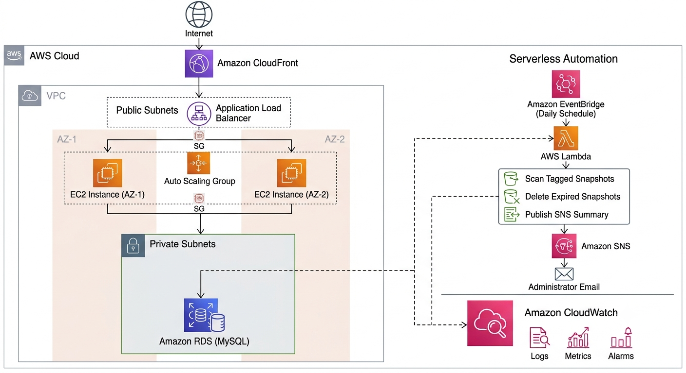

# AWS Platform Foundation


A production-inspired AWS reference architecture demonstrating how to design secure, scalable, and highly available cloud platforms using core AWS services.

This repository serves as a reference implementation for AWS networking, compute, database, monitoring, and serverless automation. It combines architectural best practices, design documentation, and working examples to illustrate how commonly used AWS services integrate to form a resilient cloud platform.

> **Note**
>
> This project is intended for learning and portfolio purposes. It demonstrates AWS architectural patterns and engineering best practices without exposing any production or proprietary infrastructure.

---

# Architecture

The following diagram illustrates the overall platform architecture, including the application layer, networking, database tier, serverless automation, and centralized monitoring.



The platform is designed following the AWS Well-Architected Framework with emphasis on:

- Security
- Reliability
- Performance Efficiency
- Cost Optimization
- Operational Excellence

---

# Core AWS Services

The reference architecture includes:

- Amazon VPC
- Public & Private Subnets
- Internet Gateway
- NAT Gateway
- Route Tables
- Security Groups
- Amazon CloudFront
- Application Load Balancer
- Amazon EC2
- Auto Scaling Group
- Amazon RDS (MySQL)
- AWS Lambda
- Amazon EventBridge
- Amazon SNS
- Amazon CloudWatch
- VPC Peering

---

# Repository Structure

```text
aws-platform-foundation
│
├── README.md
├── LICENSE
│
├── architecture/
│   ├── architecture.drawio
│   ├── architecture.png
│   └── decisions.md
│
├── networking/
├── compute/
├── database/
├── monitoring/
└── serverless/
```

---

# Repository Modules

## Networking

- Amazon VPC
- Public & Private Subnets
- Internet Gateway
- NAT Gateway
- Route Tables
- Security Groups
- VPC Peering

## Compute

- Amazon EC2
- Auto Scaling Group
- Application Load Balancer

## Database

- Amazon RDS (MySQL)
- Private Database Deployment
- DB Subnet Groups
- Backup & Recovery Strategy

## Serverless

- EventBridge Scheduled Automation
- AWS Lambda
- Automated EBS Snapshot Cleanup
- Amazon SNS Notifications

## Monitoring

- Amazon CloudWatch Logs
- Metrics & Alarms
- EventBridge Scheduling
- Operational Monitoring

---

# Design Goals

The platform demonstrates the following engineering principles:

- High Availability
- Scalability
- Network Isolation
- Least Privilege Security
- Operational Automation
- Infrastructure Reliability
- Observability
- Cost Optimization

---

# Future Enhancements

Planned improvements include:

- Terraform Infrastructure as Code
- GitHub Actions CI/CD
- Amazon EKS
- AWS IAM Best Practices
- AWS Config
- AWS Systems Manager
- AWS CloudTrail
- Amazon GuardDuty

---

# License

This project is licensed under the MIT License.